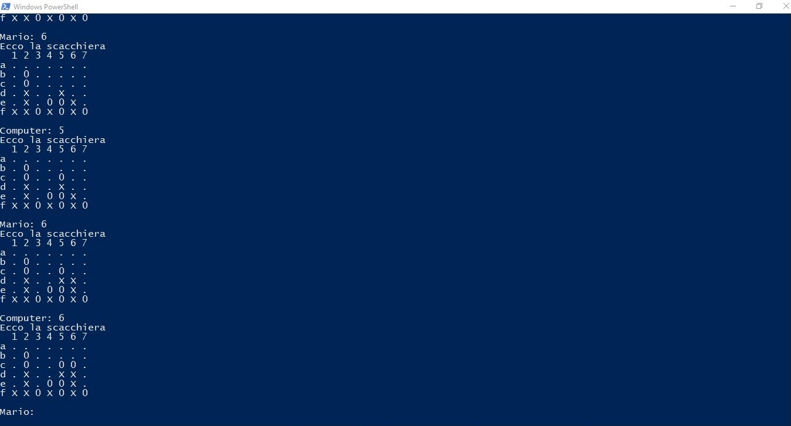

# Versione 4
In questa versione il giocatore gioca contro il computer.

Possono effettuare più partite e iniziano a turni alterni.

L'algoritmo di analisi se è presente una vittoria è da migliorare.

L'utente non può inserire il token in qualsiasi posizione!

La posizione deve essere valida e il nuovo token è inserito al di sopra di quelli già esistenti.

